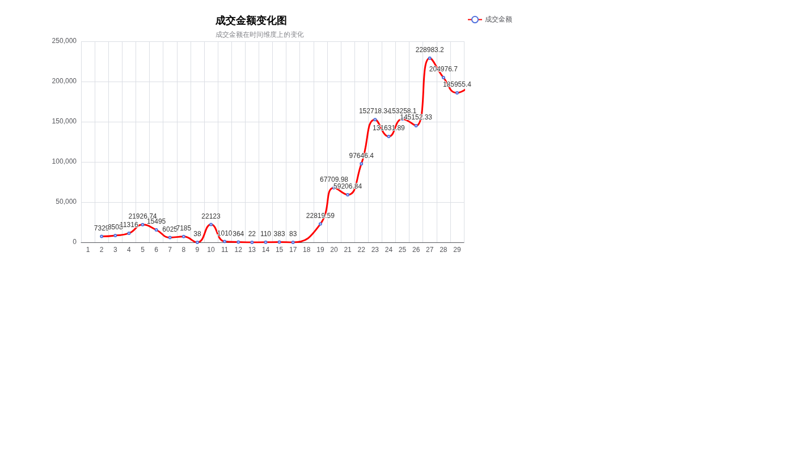
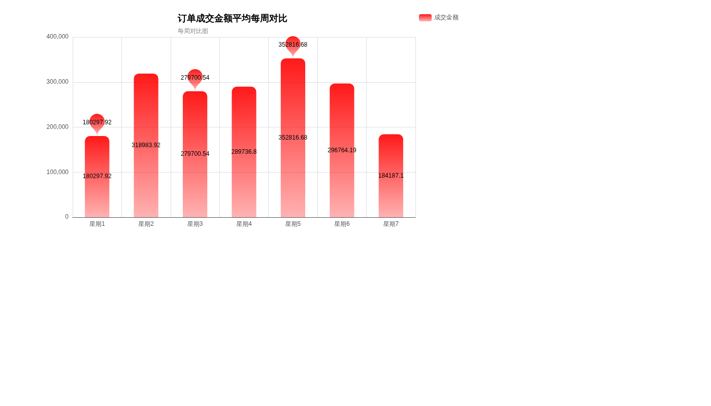
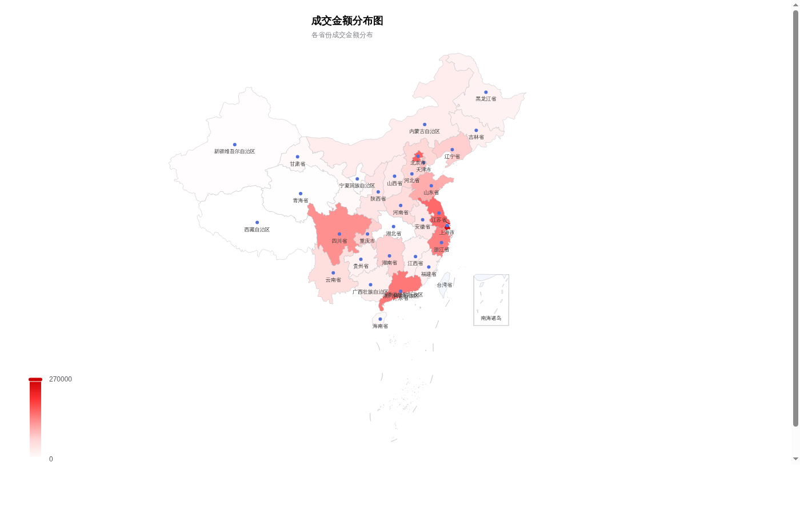
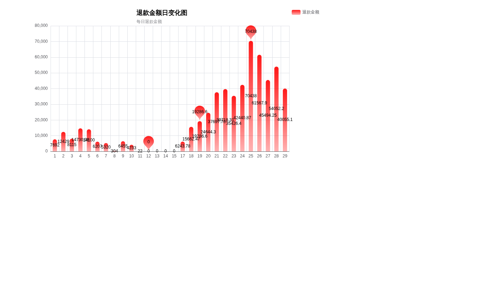
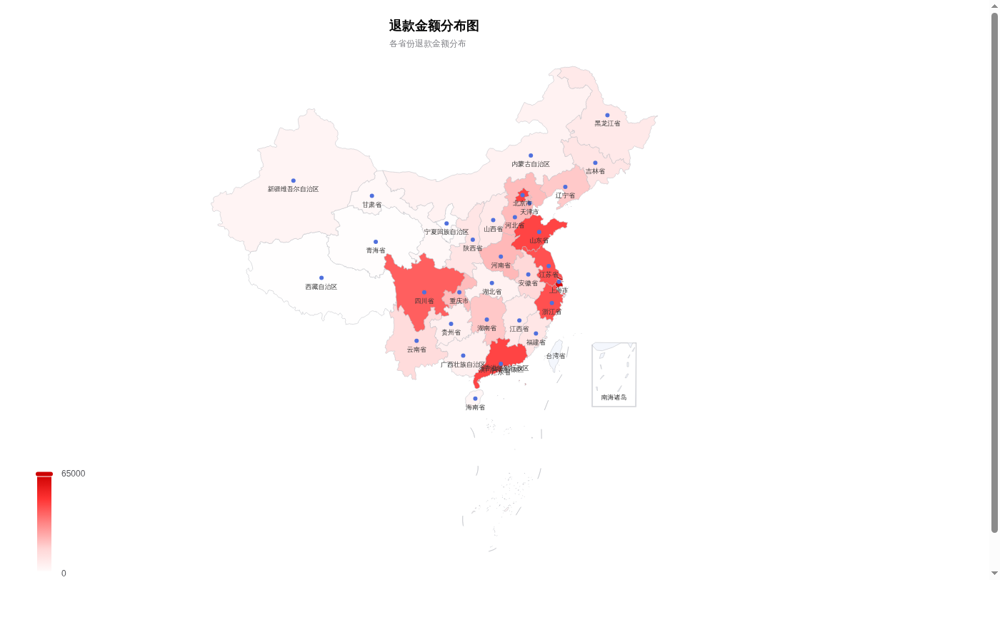

# 天猫订单数据分析

基于天猫订单数据，使用 Python（Pandas + Pyecharts）对成交金额与退款金额在**时间维度**和**地区维度**上进行多维度探索性分析，挖掘销售规律、地区差异与退款风险，为运营决策提供数据支撑。

## 技术栈

- **Python 3** + **Pandas**：数据清洗、字段处理、时间特征提取、分组聚合
- **Pyecharts**：交互式可视化（折线图、柱状图、3D中国地图）
- **Matplotlib / Seaborn**：概率密度分布图（KDE），用于识别数据分布与极端值

## 数据概览

- **数据来源**：天猫平台订单报表（`tmall_order_report.csv`）
- **时间跨度**：2月1日 — 2月29日，共29天
- **覆盖地区**：全国31个省/自治区/直辖市
- **数据规模**：约2.8万条订单记录
- **核心指标**：总成交金额 **1,902,487.15 元**，总退款金额 **572,335.92 元**，整体退款率 **30.08%**

## 数据清洗与预处理

在正式分析前，对原始数据进行了以下清洗工作：

1. **字段名去空格**：原始数据列名存在前后空格，统一使用 `strip()` 清理
2. **时间格式转换**：将「订单创建时间」「订单付款时间」转为 datetime 格式，并提取月、日、星期、小时等时间维度字段
3. **缺失值处理**：存在部分订单有创建时间但无付款时间（未支付订单），分析成交金额时将其过滤，避免干扰
4. **地址标准化**：去除省/自治区后缀，将「新疆维吾尔」「广西壮族」「宁夏回族」统一简化为「新疆」「广西」「宁夏」
5. **极端值过滤**：通过 KDE 概率密度图发现总金额存在超过5000元的极端订单，在分布分析中予以过滤，但在金额汇总中保留
6. **重复值检查**：确认无重复记录

```python
# -*- coding: utf-8 -*-
"""
天猫订单数据分析
分析维度：成交金额/退款金额 在时间维度和地区维度上的分布
可视化工具：Pyecharts（折线图、柱状图、3D地图）+ Matplotlib/Seaborn（KDE分布图）
"""
import pandas as pd
from pyecharts.charts import Bar,Map3D,Line
import matplotlib.pyplot as plt
import warnings
from pyecharts import options as opts
from pyecharts.globals import ChartType
from pyecharts.commons.utils import JsCode

# 字体设置
plt.rcParams['font.sans-serif']=['Microsoft YaHei']
plt.rcParams['axes.unicode_minus']=False
plt.rc('font',family = 'Microsoft YaHei',size = '15')
warnings.filterwarnings("ignore")

# 读取天猫订单数据
df = pd.read_csv(r"E:\tcl\tmall_order_report.csv")
df.head(10)

# 去除字段名中的空格
new_columns = [col.strip() for col in df.columns]
df.columns = new_columns

# 查看数据基本信息
df.info()
print('数据的时间区间为',df['订单创建时间'].min(),'到',df['订单创建时间'].max())
print('收货地址总计有：',df['收货地址'].nunique(),'个')
df.describe()

# 将时间字段转为datetime格式，提取月、日等时间维度
df['订单创建时间'] = pd.to_datetime(df['订单创建时间'])
df['订单付款时间'] = pd.to_datetime(df['订单付款时间'])
df['月'] = df['订单付款时间'].dt.month
df['日'] = df['订单付款时间'].dt.day

# 过滤掉未付款的订单（付款时间为空）
df2 = df[~df['订单付款时间'].isnull()].copy()
# 构造日期和星期字段，用于后续分组聚合
df2['月'] = df2['月'].apply(lambda x:int(x)).astype('str')
df2['日'] = df2['日'].apply(lambda x:int(x)).astype('str')
df2['日期'] = df2['月'] + '月' + df2['日'] + '日'
df2['周'] = df2['订单付款时间'].dt.weekday + 1
df2['周'] = '星期' + df2['周'].astype('str')
df2['月'] = df2['月'].astype('int')
df2['日'] = df2['日'].astype('int')
df2 = df2.sort_values(by = '订单付款时间')
df2['小时'] = df2['订单付款时间'].dt.hour
print(df2.head())

# 查看并优化收货地址信息（去除省/自治区后缀，统一少数民族自治区名称）
print(df2.收货地址.unique())
df2['收货地址'] = df2.收货地址.apply(lambda x:x.strip('省|自治区'))
df2['收货地址'] = df2.收货地址.replace(['新疆维吾尔','广西壮族','宁夏回族'],['新疆','广西','宁夏'])
df2.head()
print(df2.收货地址.unique())

# 检查缺失值和重复值
print(df[df['订单付款时间'].isnull()].head())
df[df['退款金额'] > df['总金额']]
print('重复值数量为：',df.duplicated().sum())
```

通过 KDE 概率密度图查看金额分布，过滤极端值：

```python
def kde_plot_array(df):
    """
    绘制概率密度图矩阵函数
    df:要绘制图像的dataframe
    绘制各个字段的概率密度分布，最终返回图像的show()
    """
    import matplotlib.pyplot as plt
    import seaborn as sns
    plt.figure(figsize = (24,16))   
    col_count = len(df.columns)
    row_num = int(round(col_count / 2, 0))
    for num, index in enumerate(df.columns):
        plt.subplot(row_num, 2, num+1)
        sns.kdeplot(df[index], shade = True, label = index, alpha = 0.7)
        plt.legend()
        plt.title(f'{index}分布图', fontsize=14)
        plt.xlabel('')   
        plt.ylabel('Density', fontsize=12)
    plt.subplots_adjust(hspace=0.4) 
    plt.tight_layout()
    return plt.show()

# 过滤极端数据（总金额>5000的异常订单），只看主流订单的金额分布
df.describe()
df[df.总金额 > 5000]
plot_df = df[(df.总金额 < 500)&(df.退款金额 < 400)][['总金额','买家实际支付金额','退款金额']]
kde_plot_array(plot_df)
```

## 一、每日成交金额趋势

按日期聚合买家实际支付金额，使用 Pyecharts 折线图观察全月成交走势。

```python
# 1. 数据聚合：按日期统计每日成交总额
change = df2[['买家实际支付金额', '日']].groupby('日').sum().round(2).reset_index().sort_values(by='日')

# 2. 折线图函数
def echarts_line(x, y, title='主标题', subtitle='副标题', label='图例'):
    line = Line(
        init_opts=opts.InitOpts(bg_color='#ffffff')  # 白色背景
    )
    line.add_xaxis(x)
    line.add_yaxis(
        series_name=label,
        y_axis=y,
        is_smooth=True,
        is_symbol_show=True,  
        label_opts=opts.LabelOpts(is_show=True),  
        linestyle_opts=opts.LineStyleOpts(color='#ff0000', width=3),  
        areastyle_opts=opts.AreaStyleOpts(
            color=JsCode("""new echarts.graphic.LinearGradient(0, 0, 0, 1, [{
                offset: 0, color: 'rgba(255, 0, 0, 0.4)'
            }, {
                offset: 1, color: 'rgba(255, 0, 0, 0.05)'
            }], false)""")
        )
    )
    line.set_global_opts(
        title_opts=opts.TitleOpts(
            title=title,
            subtitle=subtitle,
            pos_left='center',
            title_textstyle_opts=dict(color='#000000')
        ),
        legend_opts=opts.LegendOpts(is_show=True, pos_left='right', pos_top='3%')
    )
    line.render("每日成交额.html")
    return line

# 3. 调用函数生成每日成交金额折线图
echarts_line(
    x=change['日'].tolist(),
    y=change['买家实际支付金额'].tolist(),
    title='成交金额变化图',
    subtitle='成交金额在时间维度上的变化',
    label='成交金额'
)
```



**分析：**

- **上旬低迷（1日—17日）**：前17天总成交仅 104,911.74 元，日均 6,171 元。其中11日—17日连续多日成交接近0元，8日当天甚至只有38元，说明这段时间几乎没有有效成交
- **下旬爆发（18日—29日）**：从18日开始成交金额突然拉升，后12天总成交达 1,576,478.81 元，日均 131,373 元，**是上旬日均的21.3倍**
- **峰值出现在26日**：单日成交 228,983.20 元，为全月最高点；27日—29日维持在18万—20万的高位
- **增长节奏**：18日—22日为快速爬坡期（2.3万→9.8万），23日—29日进入高位平台期（13万—23万），说明活动效果持续而非一日脉冲

**推测原因：** 2月18日恰好是春节后复工节点，结合成交的爆发式增长，大概率是店铺在节后启动了促销活动（如开工大吉、春季上新），且活动持续了约两周。

## 二、每周成交金额对比

按星期维度聚合成交金额，使用 Pyecharts 柱状图分析一周内的销售节律。

```python
# 1. 数据聚合：按星期统计每周成交总额
week_change = df2[['周', '买家实际支付金额']].groupby('周').sum().round(2).reset_index()

# 2. 柱状图函数
def echarts_bar(x, y, title='主标题', subtitle='副标题', label='图例'):
    bar = Bar(init_opts=opts.InitOpts(bg_color='#ffffff'))
    # 传入x轴、y轴数据
    bar.add_xaxis(x)
    bar.add_yaxis(
        series_name=label,
        y_axis=y,
        category_gap="50%",  
        label_opts=opts.LabelOpts(is_show=True)  
    )
    # 配置柱子样式 + 标记点
    bar.set_series_opts(
        # 标记点：最大值、最小值、平均值
        markpoint_opts=opts.MarkPointOpts(
            data=[
                opts.MarkPointItem(type_="min", name="最小值"),
                opts.MarkPointItem(type_="max", name="最大值"),
                opts.MarkPointItem(type_="average", name="平均值")
            ]
        ),
        itemstyle_opts=opts.ItemStyleOpts(
            color=JsCode("""new echarts.graphic.LinearGradient(0, 0, 0, 1, [{
                offset: 0, color: 'rgba(255, 0, 0, 0.9)'
            }, {
                offset: 1, color: 'rgba(255, 0, 0, 0.3)'
            }], false)"""),
            border_radius=[10, 10, 0, 0]
        )
    )
    # 全局配置：标题、图例
    bar.set_global_opts(
        title_opts=opts.TitleOpts(
            title=title,
            subtitle=subtitle,
            pos_left='center',
            title_textstyle_opts=dict(color='#000000')  # 标题改黑色，适配白底
        ),
        legend_opts=opts.LegendOpts(
            is_show=True,
            pos_left='right',
            pos_top='3%'
        )
    )
    bar.render(f"{title}.html")
    return bar

# 3. 调用函数生成每周成交对比柱状图
echarts_bar(
    x=week_change['周'].tolist(),
    y=week_change['买家实际支付金额'].tolist(),
    title='订单成交金额平均每周对比',
    subtitle='每周对比图',
    label='成交金额'
)
```



**分析：**

- **周五是绝对的成交高峰**，达到 352,816.68 元，高于周均值（271,784 元）29.8%
- **周一和周日是低谷**，分别为 180,297.92 元和 184,187.10 元，均低于均值约32%—34%
- **周二至周六保持高位**：周二（31.9万）> 周六（29.7万）> 周四（29.0万）> 周三（28.0万），均高于周均值
- **周五比周一高出95.7%**，差距接近一倍，周内销售波动非常明显

**业务建议：**

- 推广预算应向**周五至周六**倾斜，这两天用户购买意愿最强，投放ROI最高
- 周一和周日可安排店铺维护、复盘、上新准备等非销售工作
- 促销活动的启动日最好选在**周四或周五**，可以承接周末的购买高峰

## 三、成交金额地区分布

按省份聚合成交金额，通过 Pyecharts 3D 中国地图展示各地区消费能力差异。

```python
# 1. 按省份统计成交总额，降序排列
change_map = df2[['收货地址','买家实际支付金额']].groupby('收货地址').sum().round(2).reset_index().sort_values(by='买家实际支付金额', ascending=False)

# 2. 3D地图函数
def map3d_with_bar3d(province, data_list, title, label):
    # 全国各省份经纬度坐标
    pos = {
        '黑龙江':[127.97,45.37],'上海':[121.46,31.29],'内蒙古':[110.35,41.49],'吉林':[125.82,44.26],
        '辽宁':[123.12,42.12],'河北':[114.50,38.10],'天津':[117.42,39.42],'山西':[112.34,37.94],
        '陕西':[109.12,34.20],'甘肃':[103.59,36.30],'宁夏':[106.36,38.18],'青海':[101.40,36.82],
        '新疆':[87.92,43.59],'西藏':[91.11,29.97],'四川':[103.95,30.76],'重庆':[108.38,30.44],
        '山东':[117.16,36.87],'河南':[113.47,34.62],'江苏':[118.81,31.92],'安徽':[117.29,32.06],
        '湖北':[114.39,30.66],'浙江':[119.53,29.88],'福建':[119.45,25.92],'江西':[116.00,28.66],
        '湖南':[113.08,28.26],'贵州':[106.70,26.77],'广西':[108.48,23.12],'海南':[110.39,19.85],
        '广东':[113.28,23.13],'北京':[116.41,39.90],'云南':[102.71,25.04],'香港':[114.17,22.28],
        '澳门':[113.55,22.20],'台湾':[121.52,25.03]
    }
    # 将金额数据拼接到对应省份的坐标中
    for p, v in zip(province, data_list):
        if p in pos:
            pos[p].append(v)
    data = list(zip(pos.keys(), pos.values()))

    # 创建3D地图
    map_3d = Map3D(init_opts=opts.InitOpts(bg_color='#ffffff', width='1200px', height='900px'))
    map_3d.add_schema(
        maptype="china",
        itemstyle_opts=opts.ItemStyleOpts(color="#e5e5e5", border_color="#999"),
        map3d_label=opts.Map3DLabelOpts(is_show=False),
        emphasis_label_opts=opts.LabelOpts(is_show=False),
    )
    map_3d.add(
        series_name=label,
        data_pair=data,
        type_=ChartType.BAR3D,
        bar_size=1.2,
        itemstyle_opts=opts.ItemStyleOpts(color="#ff0000"),  
        label_opts=opts.LabelOpts(
            is_show=True,
            color="#000000",
            font_size=12,
            position="top",
            background_color="rgba(255, 255, 255, 0.9)",
            border_color="#cccccc",
            border_width=1,
            padding=[3, 6],
            # 标签显示格式：省份名 + 金额
            formatter=JsCode("function(data){return data.name + ' ' + data.value[2];}")
        )
    )
    map_3d.set_global_opts(
        title_opts=opts.TitleOpts(title=title, pos_left='center', pos_top='10px'),
        legend_opts=opts.LegendOpts(pos_left='right', pos_top='3%')
    )
    map_3d.render(f"{title}.html")
    print("生成完成：全国成交金额分布图.html")

# 3. 调用生成成交金额3D地图
map3d_with_bar3d(
    province=change_map['收货地址'].tolist(),
    data_list=change_map['买家实际支付金额'].tolist(),
    title='成交金额分布图',
    label='成交金额'
)
```



**分析：**

- **上海一枝独秀**：以 264,039.78 元位居全国第一，占总成交额的 **13.9%**
- **TOP5 省份贡献过半成交**：上海（26.4万）、北京（16.6万）、江苏（15.9万）、广东（14.8万）、浙江（14.2万）合计占全国的 **52.3%**
- **东部沿海主导**：东部地区总成交 1,247,335 元，占全国 **65.6%**；中部占14.2%，西部占20.3%
- **第二梯队**：四川（12.8万）、山东（10.4万）、天津（9.0万）、辽宁（7.5万）、重庆（7.2万）也有不错表现
- **尾部地区**：西藏、青海、新疆、甘肃、宁夏等西部省份成交不足1万元，市场渗透率低

**业务建议：**

- 东部沿海是基本盘，应重点维护，可针对这些地区做会员运营和复购激励
- 中西部地区成交占比偏低，但四川、重庆、湖南等省份已有一定体量，可作为增长突破口
- 西藏、青海等地区成交极低，需评估物流成本与市场潜力，决定是否投入资源

## 四、每日退款金额变化

按日期聚合退款金额，观察退款趋势及其与成交的关系。

```python
# 按日期统计每日退款总额
back_money = df2[['日', '退款金额']].groupby('日').sum().round(2).reset_index()
echarts_bar(
    x=back_money['日'].tolist(),
    y=back_money['退款金额'].tolist(),
    title='退款金额日变化图',
    subtitle='每日退款金额',
    label='退款金额'
)
```



**分析：**

- **退款与成交高度同步**：退款高峰同样出现在下旬，25日达到峰值 70,438 元，比成交峰值（26日）提前约1天，符合"收货后退款"的时间逻辑
- **上旬退款率异常偏高**：上旬退款率高达 **73.4%**（退款7.7万 vs 成交10.5万），这并非说明上旬订单质量差，而是因为上旬成交极少，但退款中有相当一部分来自**1月及更早的订单**，导致退款金额远超当期成交
- **下旬退款率回落至30.9%**：下旬成交1,576,479元，退款486,514元，退款率30.9%，更能反映真实的订单质量水平
- **退款滞后效应明显**：成交从18日开始增长，退款从19日起同步上升，间隔约1天，说明大部分退款发生在收货后较短时间内

**业务建议：**

- 大促期间需提前增配客服人手，预计退款高峰在成交高峰后1—2天到来
- 30.9%的退款率仍然偏高，建议对退款原因做进一步归因分析（质量问题？描述不符？物流破损？冲动消费？）
- 上旬的高退款率提示需要关注跨月退款的财务对账问题

## 五、退款金额地区分布

按省份聚合退款金额，并结合成交金额计算各省退款率，识别高风险地区。

```python
# 按省份统计退款总额，复用3D地图函数
local_back_money = df2[['收货地址','退款金额']].groupby('收货地址').sum().round(2).reset_index().sort_values(by='退款金额', ascending=False)
map3d_with_bar3d(
    province=local_back_money['收货地址'].tolist(),
    data_list=local_back_money['退款金额'].tolist(),
    title='退款金额分布图',
    label='退款金额'
)
```



**各省份退款率明细（成交TOP10省份）：**

| 省份 | 成交金额（元） | 退款金额（元） | 退款率 |
|------|-------------|-------------|-------|
| 上海 | 264,039.78 | 62,418.01 | 23.6% |
| 北京 | 166,448.48 | 45,941.36 | 27.6% |
| 江苏 | 159,359.18 | 43,011.34 | 27.0% |
| 广东 | 147,822.90 | 45,588.70 | 30.8% |
| 浙江 | 141,664.80 | 43,234.80 | 30.5% |
| 四川 | 127,648.15 | 40,299.76 | 31.6% |
| 山东 | 103,917.26 | 45,415.21 | **43.7%** |
| 天津 | 89,990.06 | 22,761.08 | 25.3% |
| 辽宁 | 74,692.05 | 18,860.40 | 25.2% |
| 重庆 | 71,514.65 | 21,753.00 | 30.4% |

**分析：**

- **山东退款率异常高（43.7%）**：成交10.4万但退款高达4.5万，接近一半的订单发生退款，在成交TOP10省份中显著异常，建议重点排查该地区是否存在物流破损率高、竞品冲击、或特定商品质量问题
- **上海退款率最低（23.6%）**：高成交+低退款，说明上海地区的用户满意度最好，商品与用户需求匹配度高
- **安徽（40.3%）、福建（41.3%）、黑龙江（40.6%）** 退款率也超过40%，虽然成交体量不大，但同样需要关注
- **新疆、湖北退款金额超过成交金额**（退款率分别为159.9%和284.6%），这是因为当期成交极少但存在历史订单退款，属于正常现象，但需在财务上注意
- **分区域看**：中部地区退款率最高（36.2%），东部（29.1%）和西部（29.2%）相对较低

**业务建议：**

- 山东作为高成交+高退款省份，应作为售后优化的**首要目标**，拉取退款原因明细做专项分析
- 上海的高成交低退款模式值得研究，可将上海地区的选品和运营策略复制到其他东部省份
- 对退款率超过40%的省份，建议抽查客服聊天记录和退货物流信息，定位具体原因

## 综合洞察与建议

### 核心发现

1. **销售节奏高度集中**：下旬12天贡献了93.8%的成交额，销售活动对成交的拉动作用极为显著
2. **周五效应明显**：周五成交比周一高出近一倍，周内投放节奏需要精细化
3. **地区集中度高**：TOP5省份贡献过半成交，东部沿海是绝对主力
4. **退款率偏高**：整体退款率30.08%，山东等省份异常突出，售后体验有较大优化空间
5. **退款滞后成交约1天**：大促后客服和售后压力可预期、可准备

### 行动建议

- **营销节奏**：活动启动日选在周四/周五，预算集中在周五至周六；周一/周日安排复盘和维护
- **地区运营**：东部做复购和会员，中西部做渗透和拉新；山东做售后专项治理
- **售后准备**：大促期间提前储备客服人力，成交高峰后1—2天是退款咨询高峰
- **退款归因**：建议下一步对退款订单做文本挖掘（退款原因分类），定位是商品质量、物流还是描述问题
- **数据完善**：本次分析缺少订单量、客单价、商品类目等维度，补充后可做更深入的用户行为分析
